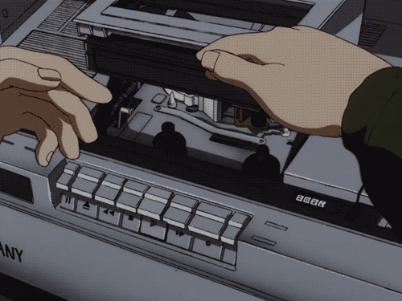

  

  
  

<h1 align="center">Eric Ribeiro</h1>
<h3 align="center">Developer & Automation Specialist</h3>

  
  
  
  

---

### About

Technology professional with over 20 years of experience, with 6 years specifically focused on systems development. Currently dedicated to automation development using n8n and artificial intelligence integration.
Leading the BeonSafe-Opensource project to democratize access to self-hosted automation technologies.

### Current Work

**BeonSafe-Opensource** - Educational initiative for self-hosted automation technologies:

- Teaching automation development and AI agents
- Self-hosted infrastructure training
- Programming logic fundamentals
- Open source technology democratization

### Technologies

**Automation & AI**
 

**Communication & Bots**
 

**Backend & Database**
 

**Development Stack**
 

### Experience

- **2004-2025**: 20+ years of technology experience
- **2019-2025**: 6 years in systems development
- **2022-2025**: 3 years focused on automation and AI projects
- **2021-2025**: Creator and lead of BeonSafe-Opensource initiative
- **Current**: Self-hosted technologies educator and mentor

### GitHub Statistics

### Contact

  
  
  

---

  

