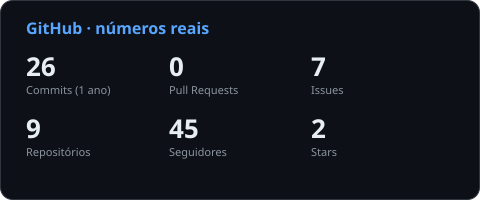
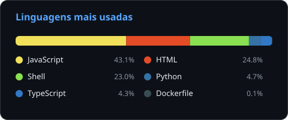

<div align="center">
  
</div>

<br />

<div align="center">
  <a href="https://www.linkedin.com/in/eric-ribeiro-15853521a/">
    
  </a>
  <a href="https://github.com/ericvasr">
    
  </a>
  <a href="mailto:eric@grupoalcate-ia.com">
    
  </a>
  <a href="https://github.com/beonsafe">
    
  </a>
</div>

<br />

<div align="center">
  
  <a href="README-EN.md">
    
  </a>
</div>

---

<h1 align="center">Eric Ribeiro</h1>
<h3 align="center">Head of Infrastructure & DevOps · Technical Lead · Grupo Alcate-IA</h3>

<p align="center">
  
  
  
  
</p>

---

### `> whoami`

Head de Infraestrutura e DevOps no **Grupo Alcate-IA**, com mais de 20 anos em tecnologia. Respondo pela plataforma que sustenta a operação: arquitetura, confiabilidade, automação e segurança, do provisionamento ao deploy. Atuo na interseção entre **infraestrutura self-hosted**, **automação inteligente** e **liderança técnica**, transformando complexidade operacional em sistemas que rodam com mínima intervenção humana.

Lidero o time de infra e DevOps, defino o padrão de engenharia e uso **IA como alavanca** para escalar o que a equipe entrega, com custo e risco sob controle. Paralelamente, mantenho a **BeOnSafe**, comunidade open-source focada em democratizar IA, automação e infraestrutura self-hosted.

Meu princípio: **tecnologia só tem valor se elimina atrito e gera resultado mensurável.**

---

### `> current_role`

```yaml
company: Grupo Alcate-IA · Criciúma, SC · Brasil
role: Head of Infrastructure & DevOps | Technical Lead
scope:
  - Arquitetura, confiabilidade e operação da plataforma
  - Infraestrutura self-hosted, provisionamento e deploy
  - Pipelines de automação e CI/CD end-to-end
  - Observabilidade, segurança e continuidade operacional
  - IA aplicada como alavanca de engenharia e automação
  - Liderança do time de infra e DevOps, padrões e mentoria
```

---

### `> tech_stack`

<details>
<summary><b>Automação, IA & Orquestração</b></summary>
<br />


</details>

<details>
<summary><b>Backend & APIs</b></summary>
<br />


</details>

<details>
<summary><b>Frontend & UI</b></summary>
<br />


</details>

<details>
<summary><b>Databases & Vector Stores</b></summary>
<br />


</details>

<details>
<summary><b>DevOps, Infra & Cloud</b></summary>
<br />


</details>

<details>
<summary><b>Messaging & Integrations</b></summary>
<br />


</details>

---

### `> metrics`

<!-- Cards gerados por mim a partir da API do GitHub (assets/*.svg no próprio repo).
     Atualizados por .github/workflows/stats.yml. Sem SSR de terceiro = sem 503, sem imagem quebrada. -->
<div align="center">
  
  
</div>

---

### `> open_source`

<div align="center">

**BeOnSafe · Open Source AI & Automation**

Comunidade educacional independente focada em democratizar o acesso a tecnologias de IA, automação e infraestrutura self-hosted. Conteúdo técnico, formações práticas e ferramentas abertas.

<a href="https://github.com/beonsafe">
  
</a>

</div>

---

### `> timeline`

```
2004 ──── Início na área de tecnologia
   │
2019 ──── Transição para desenvolvimento de sistemas
   │
2021 ──── Fundação da BeOnSafe (open-source & educação)
   │
2022 ──── Especialização em automação e IA aplicada
   │
2024 ──── Liderança técnica de infra, DevOps & automação
   │
now  ──── Head of Infrastructure & DevOps @ Grupo Alcate-IA · Criciúma-SC
```

---

<div align="center">
  
</div>

<div align="center">
  <sub>Building systems that think, so humans don't have to.</sub>
</div>
