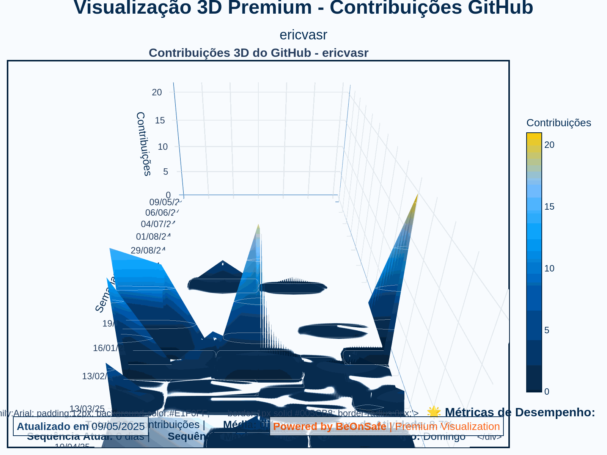

# 🔷 Git3D Premium - Visualização 3D Avançada de Contribuições GitHub

<div align="center">
  
  <p><em>Visualização 3D Premium de Contribuições do GitHub - BeOnSafe</em></p>
</div>

## 📋 Sobre o Projeto

Git3D Premium é uma ferramenta avançada para criar visualizações tridimensionais interativas e de alta qualidade das suas contribuições no GitHub. Desenvolvida com tecnologias de análise de dados e visualização 3D, esta ferramenta transforma seu histórico de contribuições em uma impressionante representação visual profissional.

### ✨ Características Premium

- **Renderização 3D Avançada** com efeitos de iluminação e textura
- **Gráficos Interativos** com animações suaves e controles intuitivos
- **Análise Estatística Detalhada** de padrões de contribuição
- **Múltiplos Formatos** incluindo HTML interativo, PNG em alta resolução e GIF otimizado
- **Integração com CI/CD** via GitHub Actions para atualização automática
- **Sistema de Logging e Monitoramento** para diagnóstico avançado
- **Design Responsivo** otimizado para compartilhamento em diferentes plataformas

## 🛠️ Tecnologias Utilizadas

- **Python 3.11+** - Linguagem base para análise e processamento
- **Pandas & NumPy** - Análise e transformação de dados
- **Plotly** - Visualização 3D interativa avançada
- **GitHub API GraphQL** - Coleta de dados de contribuições
- **GitHub Actions** - Automação e integração contínua
- **Kaleido & ImageIO** - Geração de imagens e GIFs em alta qualidade

## 🚀 Instalação e Uso

### Pré-requisitos

- Python 3.11 ou superior
- Token de acesso pessoal do GitHub
- Git instalado

### Instalação

1. Clone o repositório:
   ```bash
   git clone https://github.com/ericvasr/git3d.git
   cd git3d
   ```

2. Instale as dependências:
   ```bash
   pip install -r requirements.txt
   ```

3. Configure seu token do GitHub:
   - Crie um arquivo `.env` na raiz do projeto
   - Adicione seu token: `GITHUB_TOKEN=seu_token_aqui`

### Execução Manual

Para gerar sua própria visualização 3D premium:

1. Colete os dados de contribuições:
   ```bash
   python fetch_contributions.py
   ```

2. Gere a visualização 3D premium:
   ```bash
   python generate_advanced_3d.py
   ```

3. Atualize seu README:
   ```bash
   python update_readme.py
   ```

## 📊 Componentes do Sistema

### 1. Coletor de Dados (`fetch_contributions.py`)

Responsável por se conectar à API GraphQL do GitHub e coletar:
- Histórico completo de contribuições
- Dados detalhados de repositórios
- Estatísticas de issues e pull requests
- Metadados do perfil

Recursos avançados:
- Sistema de retry para requisições à API
- Tratamento robusto de erros
- Geração de múltiplos arquivos de dados
- Análise estatística preliminar

### 2. Gerador de Visualizações 3D (`generate_advanced_3d.py`)

Cria visualizações 3D avançadas a partir dos dados coletados:
- Superfície 3D com gradientes de cores profissionais
- Efeitos de iluminação e textura
- Múltiplas perspectivas de câmera
- Animação suave com rotação dinâmica

Formatos gerados:
- HTML interativo com controles
- PNG estático em alta resolução
- GIF animado otimizado
- JSON com metadados para integração

### 3. Atualizador de README (`update_readme.py`)

Integra a visualização ao seu perfil GitHub:
- Criação de seção premium no README
- Geração de badges dinâmicas
- Layout responsivo com tabelas HTML
- Inclusão de estatísticas detalhadas

### 4. Workflow Automatizado (GitHub Actions)

Automatiza todo o processo diariamente:
- Execução programada com controle de falhas
- Sistema de retry para operações críticas
- Logging detalhado para diagnóstico
- Armazenamento de artefatos para referência

## 🧩 Personalização

### Cores e Tema

Para personalizar a paleta de cores, edite a seção `BEONSAFE_COLORS` no arquivo `generate_advanced_3d.py`:

```python
BEONSAFE_COLORS = {
    'primary': '#005CB8',       # Azul principal
    'secondary': '#00A4FF',     # Azul secundário
    'accent': '#FF5500',        # Laranja como acento
    # ... adicione suas cores aqui
}
```

### Configurações Avançadas

Para personalizar aspectos visuais mais avançados:

1. **Dimensões e Proporções**:
   Encontre e ajuste os parâmetros `width`, `height` e `aspectratio` no objeto `fig.update_layout`

2. **Efeitos de Iluminação**:
   Modifique os parâmetros de `lighting` no objeto `go.Surface`

3. **Animação**:
   Ajuste os parâmetros de frames e duração na seção final do código

## 📖 Exemplo de Resultado

O resultado final integrado ao seu perfil inclui:

1. **Visualização 3D Animada** - Representação visual das suas contribuições
2. **Painéis de Estatísticas** - Resumo de métricas importantes
3. **Badges Dinâmicas** - Indicadores de atividade
4. **Links Interativos** - Acesso à versão completa

## 🛡️ Segurança e Privacidade

- Os tokens do GitHub são manipulados de forma segura
- Nenhum dado pessoal é exposto nas visualizações
- Todas as requisições seguem as melhores práticas de segurança
- Dados sensíveis são filtrados dos logs e artefatos

## 🤝 Contribuindo

Contribuições são bem-vindas! Para contribuir:

1. Faça um fork do repositório
2. Crie uma branch para sua feature: `git checkout -b feature/nova-funcionalidade`
3. Commit suas mudanças: `git commit -am 'Adiciona nova funcionalidade'`
4. Push para a branch: `git push origin feature/nova-funcionalidade`
5. Abra um Pull Request

## 📄 Licença

Este projeto está licenciado sob a licença MIT - veja o arquivo [LICENSE](LICENSE) para detalhes.

## ✨ Agradecimentos

- Equipe BeOnSafe pelo design e suporte
- Comunidade GitHub pela inspiração
- Desenvolvedores das bibliotecas utilizadas

---

<div align="center">
  <p><strong>Powered by <a href="https://beonsafe.com.br">BeOnSafe</a></strong> | Visualização Premium de Contribuições GitHub</p>
  <p>Desenvolvido por <a href="https://github.com/ericvasr">Eric Vasconcellos</a></p>
</div> 